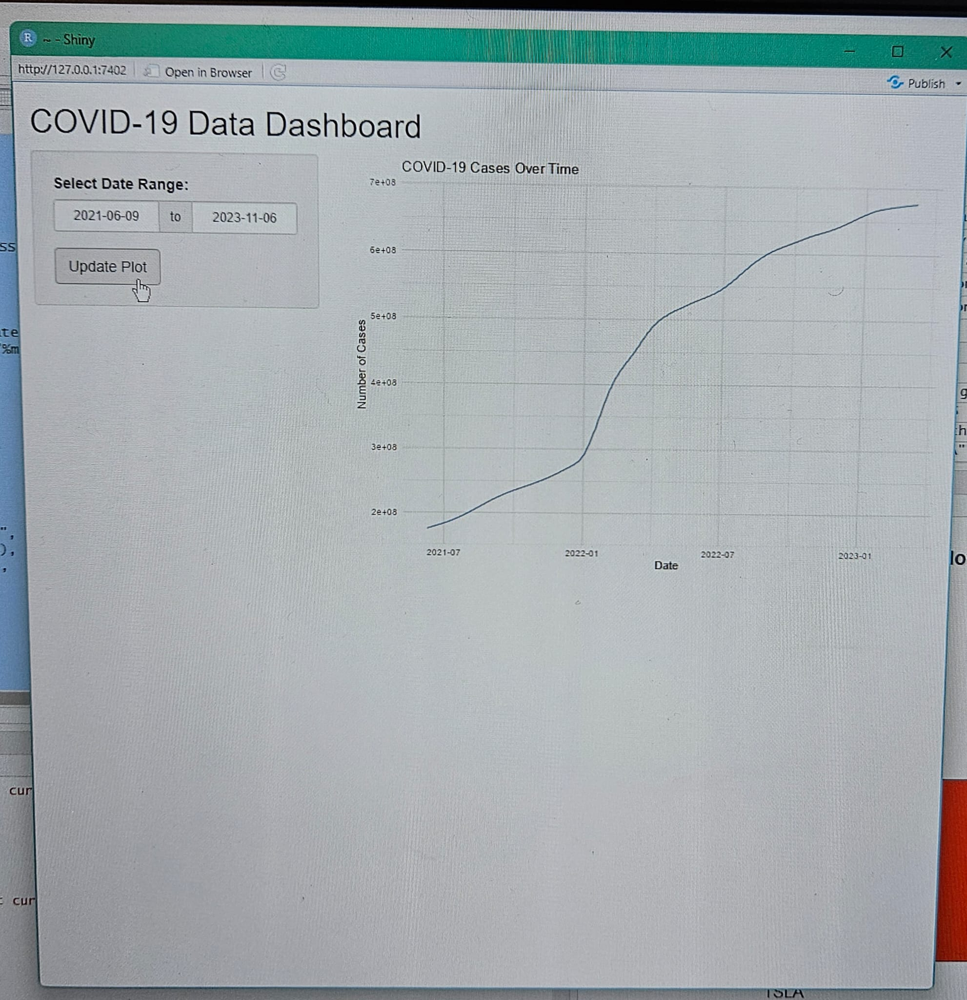

# COVID-19 Data Dashboard

This project is a Shiny web application for visualizing global COVID-19 confirmed cases over time. The app allows users to interactively select a date range and view the total number of confirmed COVID-19 cases globally within that period. The data is sourced from the [Johns Hopkins University CSSE COVID-19 Data Repository](https://github.com/CSSEGISandData/COVID-19).

## Table of Contents
- [Project Overview](#project-overview)
- [Features](#features)
- [Installation](#installation)
- [Usage](#usage)
- [Visualization and Results](#visualization-and-results)
- [Acknowledgments](#acknowledgments)

## Project Overview

The goal of this project is to create a simple and interactive web-based dashboard for visualizing the trend of COVID-19 confirmed cases over time using R and Shiny. The conditions are arbitrary and were chosen to practice data visualization and Shiny app development skills.

## Features

- Interactive date range selection for custom data visualization.
- Dynamic plotting of global COVID-19 confirmed cases over the selected date range.
- Easy-to-use user interface for exploring COVID-19 data trends.

## Installation

To run this Shiny app locally, follow these steps:

1. Ensure you have R and RStudio installed on your machine.
2. Install the required R packages by running the following commands in your R console:

   ```r
   install.packages(c("shiny", "ggplot2", "dplyr", "tidyverse"))
   ```

## Usage

To use this Shiny app for visualizing COVID-19 data:

1. **Install Required Packages**: Ensure that you have the necessary R packages installed:

   ```r
   install.packages(c("shiny", "ggplot2", "dplyr", "tidyverse"))
2. **Run the App**: Clone this repository and open the R script containing the code. Run the script in RStudio or any R environment. The Shiny app will open in your default web browser.

3. **Interact with the Dashboard**:
- Use the Date Range Selector in the sidebar to select the period for analysis.
- Click the "Update Plot" button to generate a new plot based on the selected date range.
- The line plot in the main panel will display the number of confirmed COVID-19 cases over the chosen time period.

4. **Explore the Data**: The app's interactive features allow you to explore the trends and patterns in COVID-19 data dynamically.

5. **Save Plots (Optional)**: To save the plots, add ggsave() in the R code to save the visualizations as images on your local system.


## Visualization and Results

The COVID-19 Data Dashboard provides a dynamic line plot that visualizes the trend of confirmed COVID-19 cases over time. The plot updates based on the user-selected date range, allowing for detailed exploration of different periods during the pandemic.

### Visualization Example: COVID-19 Cases Over Time

- **Line Plot of COVID-19 Cases**:  
  The plot below shows the total number of confirmed COVID-19 cases worldwide over the specified date range selected by the user.

  

  - **X-axis**: Displays the dates within the selected range.
  - **Y-axis**: Represents the number of confirmed COVID-19 cases.
  - **Line Color**: The line is colored in steel blue for better visualization.

### Insights from the Results

1. **Trend Analysis**:  
   The line plot helps identify the overall trend in confirmed COVID-19 cases globally. Users can observe peaks, drops, and shifts in the trend throughout the pandemic.

2. **Data Exploration**:  
   The interactive nature of the app enables users to explore data over different time frames, such as analyzing specific months, comparing waves of infections, or focusing on particular stages of the pandemic.

3. **Date Range Flexibility**:  
   By selecting different date ranges, users can drill down into specific periods to better understand the changes in case numbers, making it an effective tool for data analysis and presentation.

### Example Scenarios

- **Global Case Spike**: When selecting dates around March to May 2020, the plot shows a significant spike in cases, corresponding to the first wave of COVID-19 in many parts of the world.
  
- **Second Wave Analysis**: Choosing dates from October 2020 to January 2021 shows another surge, allowing users to compare the magnitude and impact of different waves.

### Dynamic Interaction

By using the app's interactive date range selector and "Update Plot" button, the plot is regenerated in real-time, offering flexibility to analyze various trends and patterns within the data.

## Acknowledgements

This project uses the publicly available COVID-19 time series data provided by the Johns Hopkins University CSSE COVID-19 Data Repository.
